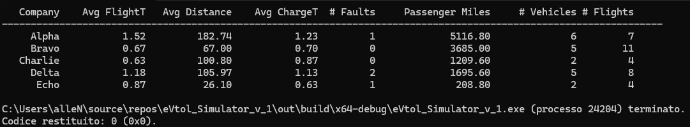
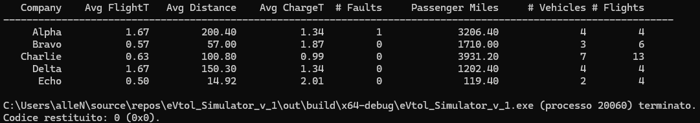

# eVtol_Simulator

1.The idea is to have a base class called Vehicle, which defines all the common characteristics among different eVTOLs. 
Then, a series of subclasses statically define the unique attributes of the aircraft developed by the five manufacturing companies.

2.Later, an eVTOL factory class was created to dynamically generate instances of the vehicles that will be tested in the simulator. 
This approach is preferable because the number of vehicles of each type is unknown and varies each time the code is executed.

3.Next, a Charger class needs to be implemented. Each charger becomes available to the first vehicle in the charging queue, so it requires attributes to track availability and remaining charging time.
A factory class for chargers is unnecessary since all chargers are identical and can be created using a simple loop.

4.Finally, a Simulator class must be created with a loop that emulates the passage of time at an accelerated rate. 
This class implements functions to record flight data, manage charging queues, and handle fault events.

Assumption: The average charging time for each vehicle includes the time spent in the queue waiting for a charger to become available, as this is considered part of the charging cycle. 
This means that overall charging times are highly dependent on the composition of the fleet—slower-charging vehicles that increase the waiting time for all others.

The following is a simple UML diagram made to give a general understanding of the project structure.
Only the main variables and methods of the Simulation class are represented

The following are some examples of the data generated during the simulation process:

Observations:

  1.Average charge times are calculated based on the above stated assumption, hence the average charging time variates a lot from simulation to simulation based on the amount of time spent in queue for an available charger.
  
  2.Some eVTOL companies display average ranges and flight times that perfectly align with vehicle expectations. This happens because, at the time the simulation ends, all their vehicles are either on the ground, in queue, or charging.
  
  3.Some eVTOLS companies might display average ranges and flight times that look odd at first glance, this is caused by the fact that it is possible for the simulation to end while some of the company's vehicles are still flying.
    This causes the ratio (miles flown/flights) to go below expectations as the number of flights has increased while the last flight's miles where under the maximum range.
    Same concept applies to average flight time (total time flown/number of flights), lowering the average flight time.
